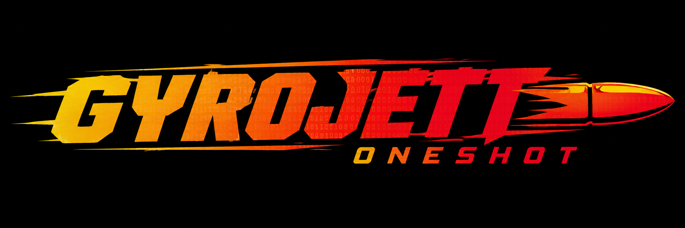

<p align="center">
  
</p>

<h1 align="center">GyroJett OneShot</h1>

<p align="center">
  <b>Lightweight • Secure • Privacy-focused Messenger</b>
</p>

<p align="center">
  <a href="LICENSE">
    
  </a>
  
  
</p>
---

## About

**GyroJett OneShot** is a lightweight messaging project focused on **privacy, security and simplicity**.

The goal is to build a messenger that keeps the communication stack small, understandable and free from unnecessary features.

No giant framework.

No advertising.

No unnecessary telemetry.

Just a small messenger built with privacy in mind.

> **Lightweight. Secure. Private.**

## Why?

Modern messaging applications can become extremely complex, bringing along analytics, tracking, large dependency trees and services that users don't necessarily need.

GyroJett OneShot takes a different approach:

```text
                    ┌──────────────────┐
                    │  GyroJett Server │
                    │                  │
                    │   Tor / Network  │
                    └────────┬─────────┘
                             │
                 ┌───────────┴───────────┐
                 │                       │
          ┌──────▼──────┐         ┌──────▼──────┐
          │   Client A  │         │   Client B  │
          │             │         │             │
          │    GPG      │         │    GPG      │
          └─────────────┘         └─────────────┘
```

The project is designed around minimizing unnecessary complexity while keeping security and privacy as core goals.

## Features

Current and planned features include:

* Lightweight C implementation
* Privacy-oriented architecture
* End-to-end cryptographic communication
* GPG-based identity
* Tor support
* Minimal dependencies
* No advertising
* No unnecessary telemetry
* Temporary messaging
* Secure file transfer

Some features are still under development.

## Project Status

**Early development**

GyroJett OneShot is currently a work in progress.

The project is experimental and its architecture may change significantly as development continues.

### Roadmap

* [x] Initial project
* [x] Basic C implementation
* [ ] Messaging protocol
* [ ] Tor integration
* [ ] GPG identity system
* [ ] End-to-end encryption
* [ ] Message handling
* [ ] Secure file transfer
* [ ] Connection management
* [ ] Better error handling
* [ ] Security review
* [ ] Documentation
* [ ] Stable release

## Building

### Requirements

Currently, development is primarily targeted at Linux.

Required tools:

* GCC
* Git
* GnuPG
* Tor

### Clone

```bash
git clone https://github.com/GutGutGutGut/GyroJett-Oneshot.git
cd GyroJett-Oneshot
```

### Build

```bash
gcc src/gyrojett1s.c -o gyrojet
```

### Run

```bash
./gyrojet
```

## Security

Security is one of the main goals of GyroJett OneShot.

The project aims to minimize:

* Metadata exposure
* Persistent message storage
* Unnecessary network communication
* Third-party dependencies
* User tracking

Cryptographic functionality is intended to use established cryptographic software rather than implementing cryptographic primitives from scratch.

### Security status

**This project has not undergone a professional security audit.**

Do not assume that GyroJett OneShot is secure simply because it uses cryptography or Tor.

Security-sensitive software requires careful review, testing and auditing.

If you find a security vulnerability, please report it responsibly.

## Privacy

GyroJett OneShot is designed around the idea that a messenger should collect as little information as reasonably possible.

The project does not aim to build a user-tracking ecosystem.

Privacy-related goals include:

* Minimal metadata
* No advertising
* No behavioral tracking
* Minimal logging
* Anonymous networking through Tor
* Cryptographic identities

## Architecture

The project intentionally aims to keep the architecture small.

```text
┌───────────────────────────────────────────┐
│               GyroJett OneShot            │
├───────────────────────────────────────────┤
│                                           │
│              Application Layer            │
│                                           │
├───────────────────────────────────────────┤
│            Messaging Protocol             │
│                                           │
├───────────────────────────────────────────┤
│             Cryptographic Layer           │
│                 GPG / OpenPGP             │
│                                           │
├───────────────────────────────────────────┤
│                Network Layer              │
│                    Tor                    │
│                                           │
└───────────────────────────────────────────┘
```

The architecture is still evolving.

## Repository Structure

```text
GyroJett-Oneshot/
│
├── app/
│   └── Instaler.sh
│
├── src/
│   └── gyrojet1s.c
│
├── README.md
└── LICENSE
```

## Contributing

Contributions, ideas, bug reports and security reviews are welcome.

If you want to contribute:

```bash
git clone https://github.com/GutGutGutGut/GyroJett-Oneshot.git
cd GyroJett-Oneshot
```

Create a branch:

```bash
git checkout -b feature/my-feature
```

Make your changes, test them and submit a pull request.

Please keep the project lightweight and avoid unnecessary dependencies.

## License

GyroJett OneShot is free and open-source software.

Licensed under the **GNU General Public License v3.0**.

See [`LICENSE`](LICENSE) for the complete license.

## Disclaimer

GyroJett OneShot is experimental software.

It is provided **"as is"**, without warranty of any kind.

The project has not been professionally audited and should not be relied upon for highly sensitive or safety-critical communications.

---

<p align="center">
  <b>GyroJett OneShot</b>
  <br>
  <sub>Lightweight. Secure. Privacy-focused.</sub>
</p>
